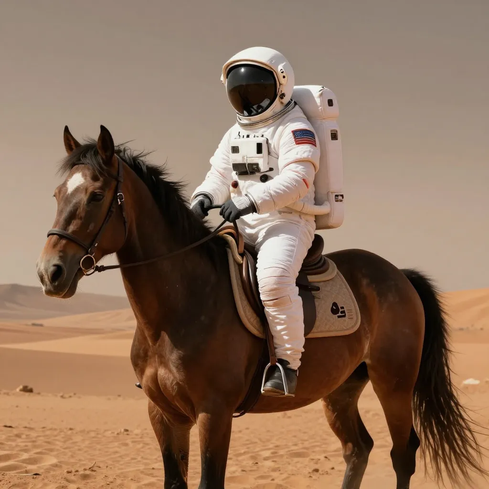
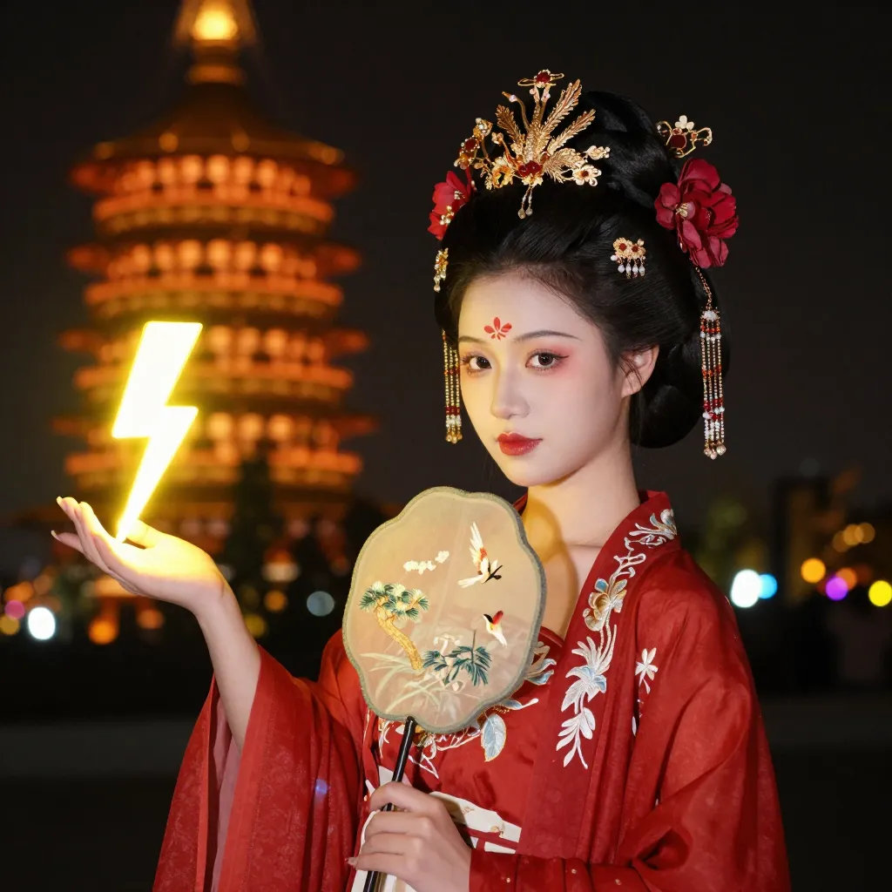
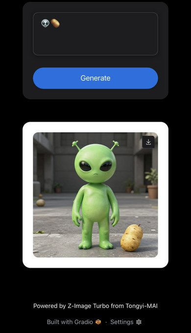
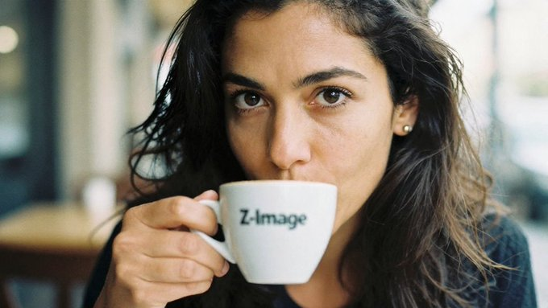
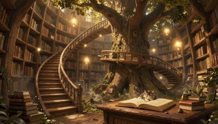
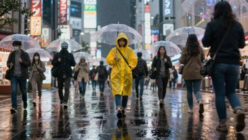

# ⚡ Awesome **Alibaba Z-Image** Prompts & Examples Gallery

⭐ Please Star or Watch this project for future updates!

last updated: Nov 29th 2025. 

## 💡 Where can I try Z-Image?
It is recommended to try for free on [z-image-edit.com](https://z-image-edit.com/) with a collection of artist-crafted built-in prompts.

## 🔍 Introduction
awesome-Alibaba-Z-Image is a curated, community-driven collection of high-quality prompts and stunning outputs generated with the [Z-Image model](https://github.com/Tongyi-MAI/Z-Image).  

Z-Image contains 3 models:  Z-Image-Turbo,  Z-Image-Base, Z-Image-Edit

This repository aims to help creators, researchers, and prompt engineers better understand how to craft effective prompts for this model. Similar repo [awesome-nano-banana-pro-prompts-and-examples](https://github.com/ZizheRuan/awesome-nano-banana-pro-prompts-and-examples).


## 📌 What This Repository Contains
- Community-shared prompts that produce high-quality or interesting results  
- Example images
- Notes, tips, and reverse-prompt insights from real-world usage

## 🎯 Purpose
This project serves as a practical reference for anyone experimenting with the Z-Image model. By collecting public examples and prompts from across the community, we aim to:
- Showcase what the model can achieve  
- Explore prompt patterns that lead to strong outputs  
- Help users learn and iterate faster  


## 🖼️ Prompt Gallery

- [✨ Cases list](#️-cases)
  - [Case 8: Astronaut riding a horse on Mars（by @ZizheRuan）](#case-8-astronaut-riding-a-horse-on-marsby-zizheruan)
  - [Case 7: Young Chinese woman in red Hanfu（by @ZizheRuan）](#case-7-young-chinese-woman-in-red-hanfuby-zizheruan)
  - [Case 6: Emoji as prompt（by @Norod78）](#case-6-emoji-as-promptby-norod78)
  - [Case 5: Woman drinking coffee from a cup with "Z-Image" on it（by @BrentLynch）](#case-5-woman-drinking-coffee-from-a-cup-with-z-image-on-itby-brentlynch)
  - [Case 4: Futuristic Mediterranean cliffside village at sunset（by @edankwan）](#case-4-futuristic-mediterranean-cliffside-village-at-sunsetby-edankwan)
  - [Case 3: Portrait of an elderly African woman sitting（by @edankwan）](#case-3-portrait-of-an-elderly-african-woman-sittingby-edankwan)
  - [Case 2: Ancient library hidden inside a giant tree（by @edankwan）](#case-2-ancient-library-hidden-inside-a-giant-treeby-edankwan)
  - [Case 1: A rainy neon lit street in Tokyo at night（by @edankwan）](#case-1-a-rainy-neon-lit-street-in-tokyo-at-nightby-edankwan)


## ✨ Cases


### Case 8: [Astronaut riding a horse on Mars](https://z-image-edit.com/)（by [@ZizheRuan](https://x.com/ZizheRuan)）

| Input | Output |
|:---:|:---:|
|  |  |

**prompt:**
```
Astronaut riding a horse on Mars, cinematic lighting, sci-fi concept art, highly detailed
```


### Case 7: [Young Chinese woman in red Hanfu](https://z-image-edit.com/)（by [@ZizheRuan](https://x.com/ZizheRuan)）

| Input | Output |
|:---:|:---:|
|  |  |

**prompt:**
```
Young Chinese woman in red Hanfu, intricate embroidery. Impeccable makeup, red floral forehead pattern. Elaborate high bun, golden phoenix headdress, red flowers, beads. Holds round folding fan with lady, trees, bird. Neon lightning-bolt lamp, bright yellow glow, above extended left palm. Soft-lit outdoor night background, silhouetted tiered pagoda, blurred colorful distant lights.
```


### Case 6: [Emoji as prompt](https://x.com/Norod78/status/1994363241779138805)（by [@Norod78](https://x.com/Norod78)）

| Input | Output |
|:---:|:---:|
|  |  |

**prompt:**
```
👽🥔
```


### Case 5: [Woman drinking coffee from a cup with "Z-Image" on it](https://x.com/BrentLynch/status/1993732411230912954)（by [@BrentLynch](https://x.com/BrentLynch)）

| Input | Output |
|:---:|:---:|
|  |  |

**prompt:**
```
A hyper-realistic, close-up portrait of a age 30 mixed heritage french-italian woman, drinking coffee from a cup that says "Z-Image" on the cup.  Natural Light. Shot on a Leica M6 with Kodak Portra 400 film grain aesthetic.
```


### Case 4: [Futuristic Mediterranean cliffside village at sunset](https://x.com/edankwan/status/1993997297835815093)（by [@edankwan](https://x.com/edankwan)）

| Input | Output |
|:---:|:---:|
|  |  |

**prompt:**
```
Futuristic Mediterranean cliffside village at sunset, white cubic houses stacked along the cliff, blue domes and solar panels on rooftops, narrow stone alleys with plants and lanterns, flying electric boats hovering above the sea, soft pastel sky with scattered clouds, wide angle view, ultra detailed architectural textures, vivid yet natural colors
```


### Case 3: [Portrait of an elderly African woman sitting](https://x.com/edankwan/status/1993997297835815093)（by [@edankwan](https://x.com/edankwan)）

| Input | Output |
|:---:|:---:|
|  |  |

**prompt:**
```
Portrait of an elderly African woman sitting in front of a mud brick house, smiling gently, deep wrinkles and expressive eyes, colorful patterned headwrap and dress, golden hour sunlight casting soft shadows, background slightly blurred village setting, natural skin pores and texture, National Geographic style documentary photography
```

### Case 2: [Ancient library hidden inside a giant tree](https://x.com/edankwan/status/1993997297835815093)（by [@edankwan](https://x.com/edankwan)）

| Input | Output |
|:---:|:---:|
|  |  |

**prompt:**
```
Ancient library hidden inside a giant tree, spiraling wooden stairs wrapped around the trunk, glowing floating books as light sources, warm golden ambient light, dust particles visible in the air, small cat sleeping on an open book on a reading desk, intricate carved runes on the bark, fantasy concept art, highly detailed, 8k illustration look
```

### Case 1: [A rainy neon lit street in Tokyo at night](https://x.com/edankwan/status/1993997297835815093)（by [@edankwan](https://x.com/edankwan)）

| Input | Output |
|:---:|:---:|
|  |  |


**input:** text prompt only

**prompt:**

```
A rainy neon lit street in Tokyo at night, viewed from low angle at pedestrian eye level, reflective puddles on the ground mirroring holographic billboards, crowds with transparent umbrellas in motion blur, one person in a bright yellow raincoat sharply in focus, shallow depth of field, cinematic style, ultra detailed, soft fog, realistic skin and fabric textures, rendered in photorealistic style
```


## 🙏 Acknowledge
All images and prompts included here are collected from **publicly shared sources** or generated through legitimate Apps/APIs**.  
This repository does **not** host internal, leaked, or proprietary data.
Cases come from X.com, RedNote and other social media. Copyrights credits to original authors and artists.

command to generate menu:
```
python scripts/update_toc.py
```